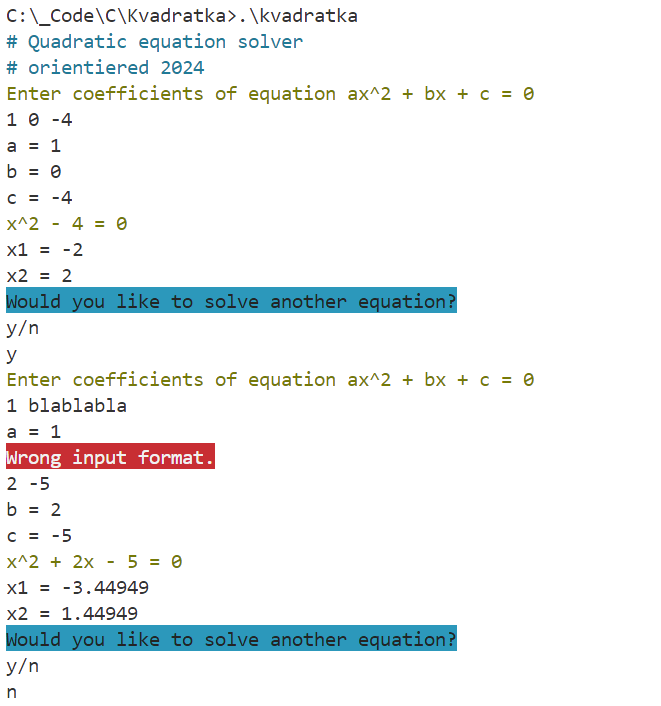
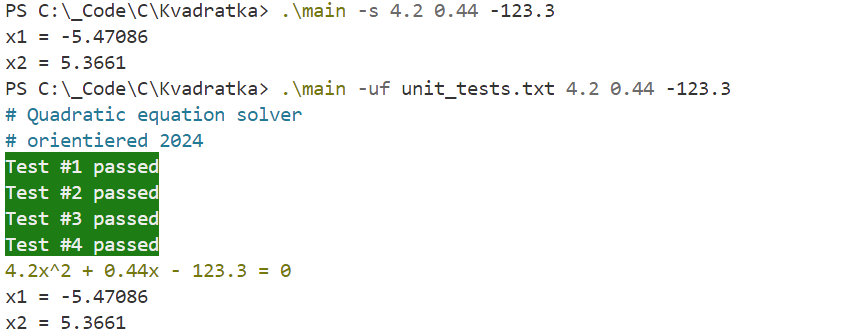

# Квадратка
*****
Эта программа умеет решать квадратные уравнения.

Была написана на летней школе по программированию от [МФТИ](https://mipt.ru).

## Оглавление

+ [Примеры](#несколько-примеров)
+ [Установка](#компиляция-и-запуск)
+ [Возможности](#возможности)
    + [Ввод через консоль](#ввод-через-консоль)
    + [Флаги и ввод через аргументы](#флаги-и-ввод-через-аргументы-командной-строки)

*****
## Несколько примеров

**У программы два основных способа ввода данных:**

1. **Через консоль:**



2. **Или через агументы при запуске программы через командную строку**



**Доступные аргументы будут описаны далее.**


*****
## Компиляция и запуск

Зависимости:
1. `git` (опционально)
2. Компилятор C или C++, например `g++`
3. `make`
4. `doxygen` и `dot` (если хотите сгенерировать документацию)

Установка:
1. Склонируйте репозиторий любым удобным способом, например
    ```
    git clone https://github.com/orientiered/Kvadratka
    ```
    Также можно просто скачать его архивом
2. По умолчанию Makefile сконфигурирован для **Windows**

    Для компиляции под Linux смотри п.3

    Откройте **директорию** проекта в терминале и соберите его при помощи команды
    ```
    make
    ```
    По умолчанию сборка происходит с компилятором `g++`, но вы можете указать свой компилятор при помощи аргумента `CC=`
    ```
    make CC=clang
    ```
    Чтобы изменить имя исполняегомого файла, укажите его с помощью аргумента `NAME=`
    ```
    make CC=gcc NAME=kvadratka.exe
    ```
    Если вы хотите перекомпилировать проект, то сначала очистите объектные файлы командой
    ```
    make clean
    ```
    Также можно сгенерировать документацию при помощи doxygen, для этого установите doxygen и dot на вашу систему и добавьте их в PATH
    ```
    make doxygen
    ```
    По умолчанию сборка проходит в папке build, документация генерируется в папке doxDocs

    Это можно изменить при помощи аргументов `OBJDIR=` и `DOXYDIR=`

3. Linux <br>
    Зайдите в Makefile и замените значение переменной `SYSTEM` на `LINUX`:

    >SYSTEM=LINUX

    Теперь вы можете выполнять команды, описанные в п.2

Запуск:

Предположим, вы скомпилировали программу с именем kvadratka.exe

1. Windows, в директории, где лежит программа
    ```
    .\kvadratka
    ```
2. Linux, в директории, где лежит программа
    ```
    ./kvadratka.exe
    ```

*****

## Возможности:

### Решение уравнения

**Важно**: программа решает уравнение в области действительных чисел

**Стоит помнить**: решения могут быть неточными, особенно в области больших чисел (10^6 и больше)

### Ввод через консоль

В программу заложено два способа ввода коэффициентов уравнения: через **консоль** и с помощью **аргументов командой строки**.

Рассмотрим подробно ввод **через консоль**.

1. Коэффициенты нужно вводить в порядке a, b, c.
2. Можно писать любое количество коэффициентов на одной строке
3. Коэффициенты можно разделять пробелами, табами, переносами строк
4. Если программа не смогла интепретировать ввод как число, то она сообщит об этом и будет пытаться считать текущий коэффициент снова.
5. Поддерживается математическая нотация, а также nan и inf
6. Чтобы было очевидно, какие коэффициенты программа смогла считать, она выводит каждый считанный коэффициент
7. Если был встречен Ctrl+D, Ctrl+Z или EOF, то программа завершится с сообщением `Scan failed`

Затем программа печатает введённое уравнение в красивом формате, а также ответы на него.

После этого пользователю предлагается решить ещё одно уравнение.

Для соглашения нужно ввести любую строку начинающуюся на `y` или `Y`

В противном случае программа завершается.

### Флаги и ввод через аргументы командной строки

При запуске из консоли можно ввести дополнительные аргументы, которые будут влиять на работу программы.

Рассмотрим доступные флаги:

- `-h` `--help` Выводит информационное сообщение с описанием флагов. Игнорирует все остальные флаги
- `-u`          Запускает внутренние юнит тесты, вшитые в программу.
- `-uf`         Запускает юнит тесты из файла, следующий аргумент интерпретирует как имя файла с тестами
- `-s`          Тихий режим, убирает часть вывода в консоль (попробуйте сами)

**После** флагов можно ввести коэффициенты квадратного уравнения через пробел

**Пример** вызова программы с флагами:

```
.\kvadratka -uf unit_tests.txt -s 1 2 3
```
Программа запустится в тихом режиме, выполнит юнит тесты из файла `unit_tests.txt` (он есть в репозитории для примера)

В тихом режиме юнит тесты будут сообщать только об ошибках

Затем будет решено уравнение с коэффициентами 1 2 3, в консоль напишется ответ

## Технические особенности

### Функция решения уравнения

Её описание необходимо для понимания работы юнит-тестов

Она принимает структуру с коэффициентами и решением.

Решение тоже предсавляет собой структуру, в которой лежат корни и поле с кодом, обозначающим количество корней.

```c++
enum solutionCode {
    ZERO_ROOTS,         ///< 0 корней
    ONE_ROOT,           ///< 1 корень
    TWO_ROOTS,          ///< 2 корня
    INF_ROOTS,          ///< Бесконечное количество корней, 0 = 0
    BAD_INPUT,          ///< Когда ввели бесконечность или NaN
    BLANK_ROOT = -1     ///< Используется для инициализации
};
```
Если *корень не имеет смысла* (например, бесконечное количество корней, второй корень при одном в решении и т.д.), то

**программа не отвечает за его содержимое** (это важно для юнит тестов)

### Формат описания юнит-тестов

Первое число в файле - количество тестов.

Затем следуют тесты в указанном количестве. (Программа попытается прочитать указанное количество тестов)

Рассмотрим формат теста:
```
a b c
exit_code x1 x2
```
Все поля должны быть разделены любыми пробельными символами (пробелы, табы, переносы строк)

`a b c` - коэффициенты уравнения

`exit_code x1 x2` - кол-во корней и ожидаемые корни

**Важно**: `exit_code` можно вводить как числом, так и в текстовом виде (см. [кол-во корней](#функция-решения-уравнения))

**Сначала** сравнивается `exit_code`, **потом** корни, **имеющие смысл**

Пример:
```
1 2 3
ZERO_ROOTS NAN NAN
```
В данном случае 0 корней, поэтому в полях `x1` и `x2` можно было написать любые числа, так как они не будут проверяться
